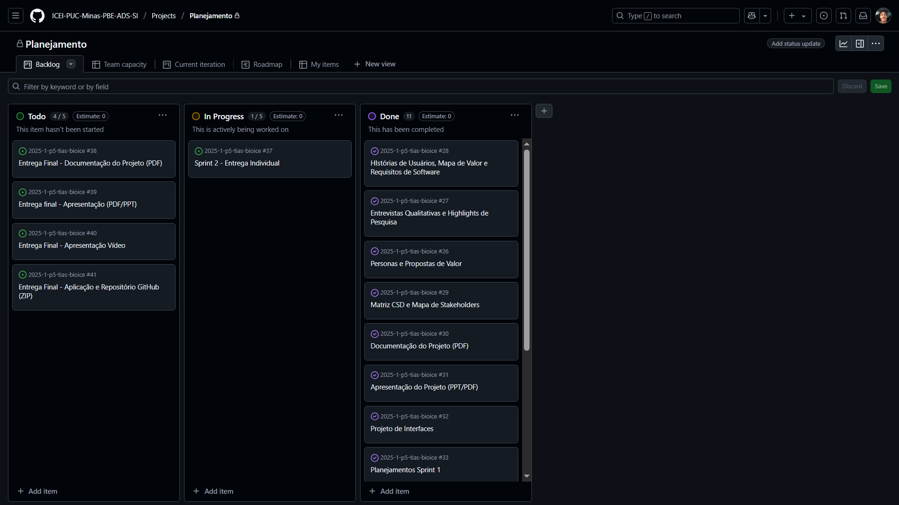

# Metodologia

## Controle de versão

A ferramenta de controle de versão adotada no projeto foi o [Git](https://git-scm.com/), sendo que o [GitHub](https://github.com) foi utilizado para hospedagem do repositório.

O projeto segue a seguinte convenção para o nome de branches:

- `main`: versão estável já testada do software
- `unstable`: versão já testada do software, porém instável
- `testing`: versão em testes do software
- `dev`: versão de desenvolvimento do software

Quanto à gerência de issues, o projeto adota a seguinte convenção para etiquetas:

- `documentation`: melhorias ou acréscimos à documentação
- `bug`: uma funcionalidade encontra-se com problemas
- `enhancement`: uma funcionalidade precisa ser melhorada
- `feature`: uma nova funcionalidade precisa ser introduzida

## Planejamento do projeto

###  Divisão de papéis

- Scrum Master: Lucas Araújo
- Product Owner: Vitor Guimarães
- Equipe de Desenvolvimento: Flávio Lara, Pedro Martins, Lucas Araújo
- Equipe de Design: Flávio Lara, Pedro Martins, Vitor Guimarães

### Processo

 
### Ferramentas

| Ambiente                            | Plataforma                         | Link de acesso                                                                 |
|-------------------------------------|------------------------------------|--------------------------------------                                          |
| Processo de Design Thinking         | Miro                               | https://miro.com/app/board/uXjVINrE89o=/                                       |
| Repositório de código fonte         | GitHub                             | https://www.figma.com/design/4Lt1uGX2Vg3KNgGUqPPnQW/Desloca-Aê?node-id=0-1&p=f |
| Documentos do projeto               | GitHub                             | http://....    ⚠️ EXEMPLO ⚠️                                                  |
| Gerenciamento do projeto            | GitHub Projects                    | http://....    ⚠️ EXEMPLO ⚠️                                                  |
| Projeto de interface                | Figma                              |https://www.figma.com/design/4Lt1uGX2Vg3KNgGUqPPnQW/Desloca-Aê?node-id=0-1&p=f  |
| Hospedagem                          | Vercel                             | http://....    ⚠️ EXEMPLO ⚠️                                                  |
